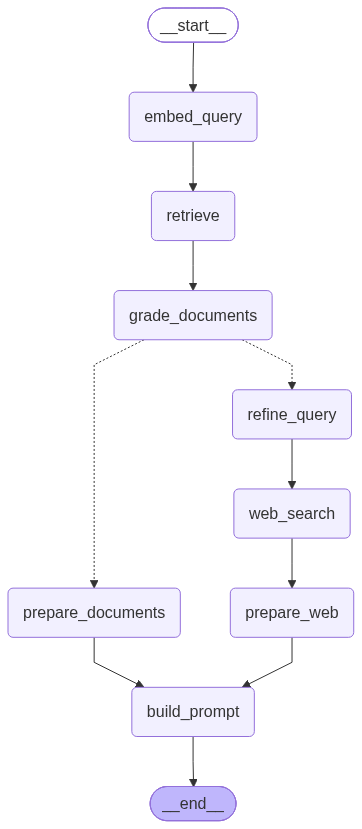
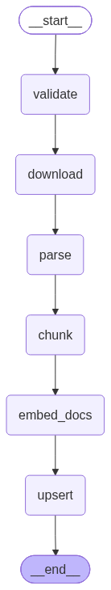

# Droply RAG

Internal FastAPI service that powers document Q&A for Droply. It ingests user files, embeds chunks with Gemini, stores vectors in Postgres (`pgvector`), and answers questions over a user's library with Groq — streamed via Server-Sent Events (SSE).

## Stack

| Layer | Technology |
| --- | --- |
| API | FastAPI + Uvicorn |
| Orchestration | **LangGraph** StateGraphs (ingest + CRAG chat) |
| Embeddings | Google Gemini (`gemini-embedding-001`, 768 dims) |
| Chat | Groq (configurable; default `llama-3.1-8b-instant`) |
| Vector store | PostgreSQL + `pgvector` |
| Document loaders | LangChain (PDF, DOCX, TXT, and related text types) |
| Web fallback | DDGS (Corrective RAG) |

## Architecture

Pipelines are modular LangGraph nodes. FastAPI only handles HTTP/SSE.

### Chat (CRAG)

```text
embed_query → retrieve → grade_documents
                              ├─ prepare_documents → build_prompt → (stream tokens)
                              └─ refine_query → web_search → prepare_web → build_prompt → (stream tokens)
```

`refine_query` rewrites the user question (using recent chat history) into a self-contained, search-engine-friendly query before DDGS web search.



### Ingest

```text
validate → download → parse → chunk → embed_docs → upsert
```



### Regenerating diagrams

```bash
python export_graphs.py
```

Outputs land in `diagrams/`:
- `chat_crag_graph.png` / `.mmd`
- `ingest_graph.png` / `.mmd`

## Features

- Download and chunk documents from a signed/public URL
- Upsert embeddings into `document_chunks` (scoped by `user_id` + `file_id`)
- Similarity retrieval across a user's full indexed library (optional `file_ids` scope)
- **Corrective RAG (CRAG):** LLM relevance grading of retrieved chunks; if all score below the threshold, fall back to web search
- Streaming chat responses (`meta` → `token` → `done` / `error`)
- Internal API auth via shared bearer key
- Node-wise LangGraph structure for readability and testing

## Requirements

- Python 3.12+
- PostgreSQL with the [`pgvector`](https://github.com/pgvector/pgvector) extension
- API keys for Gemini and Groq

## Setup

```bash
python -m venv .venv

# Windows
.venv\Scripts\activate

# macOS / Linux
source .venv/bin/activate

pip install -r requirements.txt
cp .env.example .env
```

Fill in `.env` before starting the service.

## Environment variables

| Variable | Required | Description |
| --- | --- | --- |
| `DATABASE_URL` | Yes | Postgres connection string (must support `pgvector`) |
| `GEMINI_API_KEY` | Yes | Gemini API key for embeddings (`GOOGLE_API_KEY` also accepted) |
| `GROQ_API_KEY` | Yes | Groq API key for chat completions |
| `RAG_INTERNAL_KEY` | Yes | Shared secret; callers must send `Authorization: Bearer <key>` |
| `GROQ_CHAT_MODEL` | No | Chat model (default: `llama-3.1-8b-instant`) |
| `RAG_TOP_K` | No | Number of chunks retrieved per query (default: `8`) |
| `CRAG_ENABLED` | No | Enable Corrective RAG web fallback (default: `1`) |
| `CRAG_RELEVANCE_THRESHOLD` | No | Min chunk relevance % to keep docs (default: `50`) |
| `WEB_SEARCH_RESULTS` | No | Web results to fetch on fallback (default: `5`) |
| `PORT` | No | Listen port for Docker / Procfile (default: `8001`) |

## Run locally

```bash
uvicorn main:app --reload --port 8001
```

Health check:

```bash
curl http://localhost:8001/health
```

## Docker

```bash
docker build -t droply-rag .
docker run --env-file .env -p 8001:8001 droply-rag
```

## API

All mutating/chat endpoints require:

```http
Authorization: Bearer <RAG_INTERNAL_KEY>
```

### `GET /health`

Public health probe.

```json
{ "status": "ok" }
```

### `POST /ingest`

Download a file, chunk it, embed, and upsert vectors for that `file_id` (existing chunks for the same file are replaced).

**Request**

```json
{
  "file_id": "uuid",
  "user_id": "clerk_user_id",
  "file_url": "https://...",
  "file_name": "report.pdf",
  "mime_or_type": "application/pdf"
}
```

**Response**

```json
{
  "status": "ok",
  "chunk_count": 42
}
```

### `POST /chat`

Library-wide Q&A for a user. Returns an SSE stream.

**Request**

```json
{
  "user_id": "clerk_user_id",
  "question": "What are the key findings?",
  "history": [
    { "role": "user", "content": "Summarize the intro" },
    { "role": "assistant", "content": "..." }
  ],
  "file_ids": ["uuid-optional", "uuid-optional"]
}
```

`file_ids` is optional. Omit or pass `[]` to search the user’s full indexed library; pass specific IDs to scope retrieval to those files only.

**SSE events**

| Event | Payload | When |
| --- | --- | --- |
| `meta` | `{ "mode", "sources", "relevance?", "message?" }` | After retrieve/grade (and again after web search) |
| `token` | `{ "text": "..." }` | Each streamed completion delta |
| `done` | `{ "mode", "sources", "relevance?" }` | Stream finished |
| `error` | `{ "message": "..." }` | Failure during chat |

`mode` is `"documents"` when answering from indexed files, or `"web"` when CRAG fell back to search because every chunk scored below `CRAG_RELEVANCE_THRESHOLD`.

Example:

```bash
curl -N http://localhost:8001/chat \
  -H "Authorization: Bearer $RAG_INTERNAL_KEY" \
  -H "Content-Type: application/json" \
  -d '{"user_id":"...","question":"What is this document about?"}'
```

## Project layout

```text
droply-rag/
├── main.py                 # FastAPI shell (/health, /ingest, /chat)
├── app/
│   ├── config.py
│   ├── auth.py
│   ├── models.py
│   ├── clients.py
│   ├── sse.py
│   ├── chat/               # CRAG LangGraph
│   │   ├── state.py
│   │   ├── nodes.py
│   │   ├── routing.py
│   │   └── graph.py
│   ├── ingest/             # Linear ingest LangGraph
│   │   ├── state.py
│   │   ├── loaders.py
│   │   ├── nodes.py
│   │   └── graph.py
│   ├── retrieval/          # embeddings, pgvector, sources
│   ├── grading/            # CRAG relevance grader
│   └── search/             # DDGS web fallback
├── requirements.txt
├── Dockerfile
├── Procfile
├── .env.example
└── README.md
```

## Notes

- Intended as an **internal** service called by the Droply backend — do not expose publicly without additional auth.
- In **documents** mode, answers are grounded only in retrieved context. In **web** mode (CRAG fallback), answers use search results instead.
- Supported ingest types are inferred from filename extension / MIME (PDF, DOCX, TXT, MD, CSV, and similar text formats).
